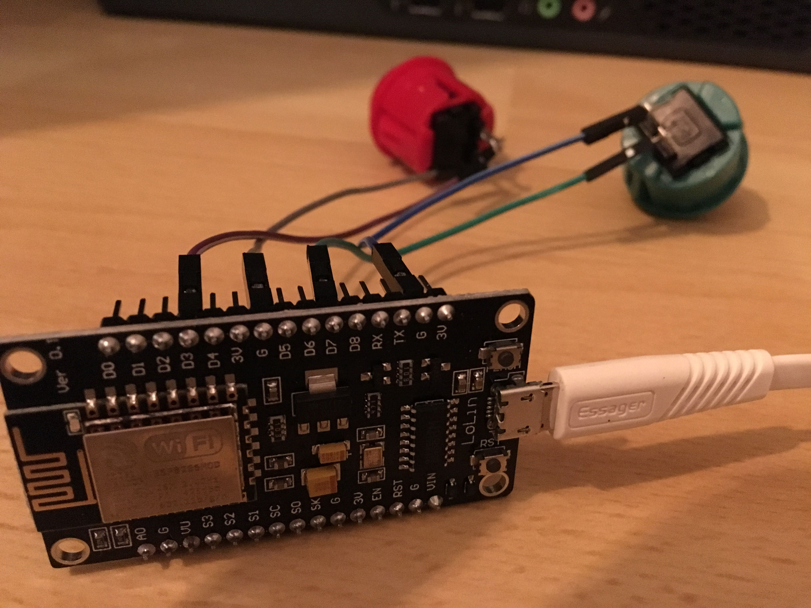

# HappinessRadar

An ESP8266 with a green and a red button to use it as an [Happiness Radar](http://www.funretrospectives.com/happiness-radar/)

TeamCity build is again red? Press the Red button :red_circle:. Saw a good review? :point_right: Green button :green_heart:

It supports also different locations, if you work in a team on different locations.

## Functionality

The [ESP8266](https://en.wikipedia.org/wiki/ESP8266) sends a request to the backend application dependent on location and button color. The backend application will increment an internal [Prometheus Counter](https://github.com/prometheus-net/prometheus-net) so you can create afterwards nice charts with [Grafana](https://grafana.com/) :bar_chart:

## Configuration

In [radar.ino](https://github.com/DominikHerold/HappinessRadar/blob/master/radar/radar.ino#L22-L32) you have to configure following part:

    const char* ssid = "foo";
    const char* password = "foo";
    const char* host = "192.168.42.42";
    int port = 5000;
    String location = "leipzig";

`host` is the IP of your backend app. Normally it runs on port 5000.

## Hardware

* [NodeMCU ESP8266, CPU/WLAN](https://de.aliexpress.com/w/wholesale-nodemcu-v3-esp8266-ch340.html?spm=2114.010208.0.0.2zt6Ca&initiative_id=SB_20170101021508&site=deu&groupsort=1&SortType=price_asc&g=y&SearchText=nodemcu+v3+esp8266+ch340)
* Arcade buttons (can be found on aliexpress.com as well)
* cable for wiring up

Connect the green button to `D7` and `Ground`. And the red button to `D3` and `Ground`

Flash the ESP with [Arduino IDE](https://en.wikipedia.org/wiki/Arduino_IDE)